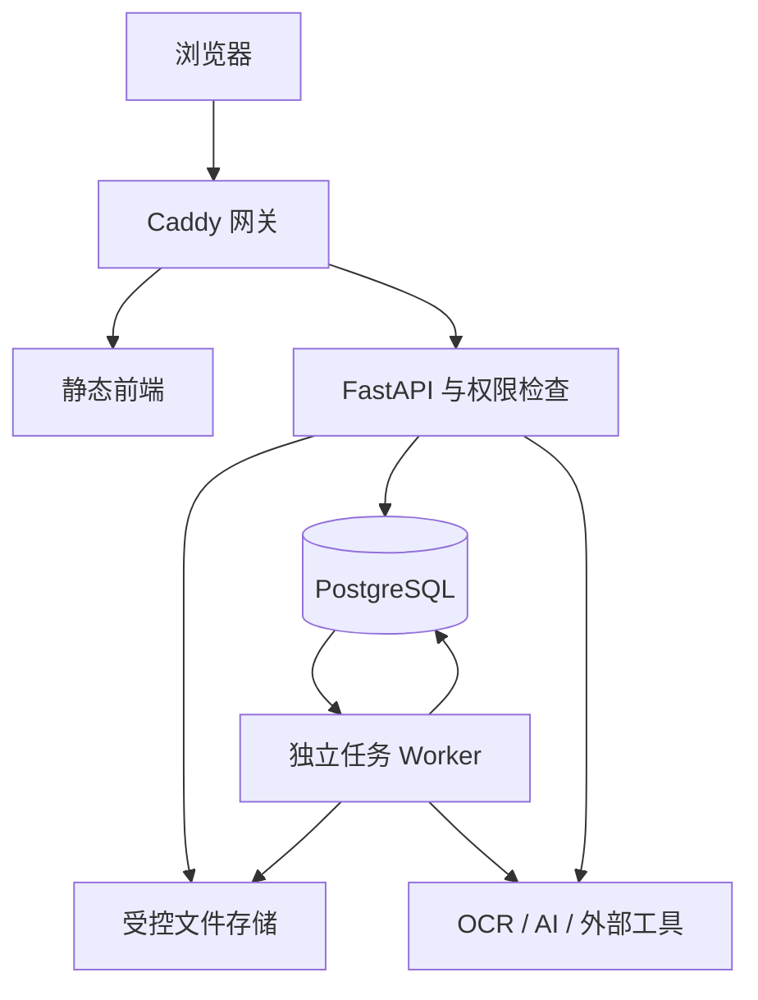

# EnerTri 代码审查与百人网页试用准备

Railway 适配入口：[`deploy/RAILWAY_DEPLOYMENT.md`](../deploy/RAILWAY_DEPLOYMENT.md)。该方案使用 Railpack，不依赖仓库内 Dockerfile；由于当前任务和产物仍依赖本地文件目录，Web 与 Worker 暂合并为单 Railway service 并挂载一个 Volume。

审查日期：2026-09-10。依据：用户提供的 `enertri_database_platform_v4.6_stage4(1).zip` 实际源代码、隔离运行结果及文末官方资料。

## 工程结论

这是一个已有完整业务雏形的模块化单体 Web 应用。无需为约 100 名试用者重写为微服务，也无需先换 React/Vue。主要工作是把演示环境改为可管理、可恢复、有权限和容量边界的服务。

**当前交付为部署准备候选版，尚不具备直接开放百人公网试用的验收条件。** 本次修复了静态目录越权入口、生产演示初始化、跨进程测验状态和缺失的网关配置，并补充部署工具；依赖漏洞、限流与费用配额、真实数据准备、PostgreSQL/容器验收仍然阻断放行。

包名和 VERSION 原为 v4.6，但 `main.py` API 版本、迁移 0008、前端执行闭环和 RELEASE_MANIFEST 均包含 v4.7。不能用目录名判断功能版本。原发行说明的验收数字属于历史记录，不是本次测试证据；已另存原 manifest，本次结果见 `VALIDATION.md`。

## 主要组件与边界

| 层次 | 主要文件 | 实际职责与边界 |
|---|---|---|
| 浏览器界面 | `frontend_api_demo/index.html`、`app.js`、各业务 JS | 原生 JavaScript，多个脚本共享全局 State，通过替换 innerHTML 渲染页面；页面导航主要是状态切换，没有独立前端构建流程 |
| API 客户端 | `frontend_api_demo/api-client.js` | 同源 `/api` fetch，JWT Bearer；token 和用户快照存在 localStorage；下载通过 fetch 后转 Blob |
| 网关 | `docker-compose.yml`、`caddy/Caddyfile` | 静态前端、HTTPS、API 反代、请求体上限；原包缺少 compose 引用的 Caddy 配置，本次补齐 |
| 业务 API | `backend/app/main.py` 与 8 个 router | FastAPI，Pydantic 校验，登录、术语、文章、学习进度、科研工作台、知识库、能力画像、项目匹配、成长规划 |
| 权限 | `security.py`、`permissions.py` | 密码散列、JWT、启用状态与角色读取；操作级 RBAC，部分业务另外限制本人/管理员 |
| 持久化 | `models.py`、`database.py`、`alembic/` | SQLAlchemy 同步 Session；开发默认 SQLite；Compose 为 PostgreSQL；Alembic 单独 init 服务负责升级 |
| 文件 | `file_service.py`、`file_validation.py` | 数据库存元信息、所有者、保密策略、哈希；实体存本地 uploads 卷，限制文件大小并验证类型；受控下载接口 |
| 异步任务 | `foundation_router.py`、`task_service.py`、`task_queue.py`、`task_worker.py` | WorkspaceTask/TaskEvent 存数据库；PostgreSQL SKIP LOCKED 抢占，租约与心跳，子进程执行，超时/取消/重试 |
| 知识处理 | `knowledge_router.py`、`paper_pipeline.py` | PDF 解析、OCR、分块、页码证据、检索和问答；使用本地哈希向量与词法评分，不是独立向量数据库或经评测的语义模型 |
| 外部能力 | `ai_service.py`、`literature.py`、`simulation.py` | OpenAI 兼容接口、OpenAlex 文献、仿真输入包及可选商业软件命令；外部服务配置与授权决定可用性 |

后端是“业务模块分文件、共享数据库与部署单元”的结构。路由层还包含不少事务及业务编排，服务层并不完全独立。AI/论文任务已有队列，但旧工作台中写作、论文、图像等接口仍同步调用外部服务，不能把“已有 Worker”理解为所有耗时工作都已异步化。

## 信息流

1. **浏览与学习：**浏览器加载 JS → API 返回已审核词条、文章 → 前端搜索/筛选与展示。登录后，收藏、学习状态、笔记和测验成绩写入用户进度。测验答案原先放 API 进程内存，本次改为数据库短期记录，提交通过原子删除消费一次。
2. **上传与论文问答：**登录用户上传 → 文件大小/格式/保密策略校验 → 文件实体和元数据落盘/入库 → 创建解析任务 → Worker 抢占并解析/OCR → 文档、页、片段和向量入库 → 按文档权限检索片段 → 返回带页码的依据。外部 AI 是否允许还取决于角色、文件及知识库策略。
3. **能力与成长：**课程/书籍/科研项目等标准资源映射到知识和能力 → 学生提交个人证据 → 按完成度、成绩、独立性、核验可信度计算画像 → 与项目需求或发展目标比较 → 给出差距、团队建议和执行路线 → 完成路线项生成待核验证据及快照 → 教师/管理员核验后再计算。
4. **科研工具：**文献查询/规则计算可直接返回；PPT、视频、论文等部分能力进入数据库队列，前端查询任务状态和事件后下载成果。商业仿真默认禁用真实执行；生成输入包不等于完成求解、许可证验证或工程结果验证。

成长画像和匹配是显式规则与权重算法。其结果反映平台设定和输入证据，不应表述为经真实人群校准的能力评定。当前“教师核验”主要依赖管理员角色，尚没有完整的导师—学生归属及委托权限体系。

## 已证实的问题与本次处理

| 优先级 | 原代码证据 / 风险 | 本次结果 |
|---|---|---|
| P0 | `main.py` 将整个 MEDIA_DIR 挂载到 `/media`，已知路径可绕过私有文件下载鉴权 | 只公开 `/media/videos`；私有 files/artifacts/workspace 不再静态服务；网关也拦截其他媒体路径。测试验证 404 |
| P0 | `utils.seed_defaults` 固定 admin/admin123、student/123456；其他 seed 还创建学生账号、证据和目标；bootstrap 无生产分支 | 生产 bootstrap 只迁移并创建指定强密码管理员，不调用演示 seed；前端不再预填/展示密码。旧库中的历史演示账号不会自动删除，迁移旧库需专项清理 |
| P0 | `security.py` 默认开发密钥；生产 compose 的 backend/worker 没有强制 APP_ENV | 增加生产启动配置拒绝检查，要求 PostgreSQL、独立 Worker、非开发密钥、禁用启动 seed；compose 强制生产模式；新增离线 preflight |
| P0 | compose 引用缺失的 Caddyfile；生产数据库密码写成常量占位符 | 补齐本地/生产网关配置；域名和数据库密码改为必填环境变量；只暴露网关，数据库不对公网映射 |
| P1 | `_quiz_sessions` 是进程字典，Docker 默认 Gunicorn 两个进程 | 新增 0009 迁移和 `quiz_store.py`：数据库存 token 摘要、有效期、答案；DELETE RETURNING 原子消费；不同 Python 进程和重放测试通过 |
| P1 | `/api/health` 不检查数据库还公开媒体绝对路径 | 去除路径；新增 `/api/ready` 检查数据库迁移版本；API 容器健康检查及网关启动依赖使用 readiness。它不代表 Worker/AI 都健康 |
| P1 | 管理迁移页硬编码预期 revision | 统一引用 HEAD_REVISION，避免新增迁移后误报 attention |
| P1 | 备份脚本吞掉 uploads 打包失败，恢复脚本未遇 SQL 错误即退出 | 移除静默忽略，psql 启用 ON_ERROR_STOP；一致性备份和恢复演练仍待完成 |
| P1 | Worker 只启动时回收过期租约 | 空闲循环增加每 30 秒检查；它不是独立调度器，长任务执行期间及全部 Worker 停机仍需外部监控 |
| P1 | 缺少受控批量建立试用账号的方法 | 新增 stdin CSV 导入脚本，整批事务、拒绝重复/已存在用户名、不允许批量授予管理员、不输出密码；新增首次改密、会话撤销和交互式管理员重置 |
| P1 | 没有集中的自动回归与安全审计流程 | 新增分进程回归脚本和 CI 配置；legacy tests 使用全局环境变量，不能简单在一个进程混跑；CI 未在远程执行 |

`pool_pre_ping` 也已开启，用于借出连接时发现失效连接；它不替代连接池容量规划。Docker 构建上下文已排除 `.env`、数据库、media 等，防止把本地密钥和数据复制进镜像。

## 仍需完成的上线阻断项

### P0：开放试用前完成

- **依赖漏洞修复与锁定。** requirements 已更新为 `python-multipart==0.0.32` 和 `PyJWT==2.13.0`，并移除旧 JWT 依赖链；但本环境未完成最终远程漏洞扫描。目标构建机仍必须执行 pip-audit、镜像扫描、回归和解析压力测试后再宣称安全。参见[官方漏洞公告](https://github.com/Kludex/python-multipart/security/advisories/GHSA-59g5-xgcq-4qw3)及[维护者最新公告列表](https://github.com/Kludex/python-multipart/security/advisories)。
- **登录保护。** 登录限流、首次改密、管理员重置和 token_version 会话撤销已加入并用数据库控制；仍需由部署负责人验证反代来源地址、账号到期/停用策略、凭据分发和告警。不能用进程内计数器实现多实例限流。
- **后台任务及 AI 额度。** 已加入数据库原子准入、用户/全局活动任务和运行槽位、每日任务次数，以及 AI 用户/全局预算预留和文本输入上限；仍缺磁盘配额、供应商账单对账和目标环境压测。文件/图像外部 AI 当前主动关闭，直到建立可靠计价模型。
- **真实权限验收。** 已有 action RBAC 和本人检查，但不等于全路由权限审计通过。至少建立学生 A/B、科研用户、审核者、管理员测试矩阵，逐项验证文件、文档、任务、证据、目标、导出、团队搜索；明确 `allow_team_search` 当前不是组织成员模型。公开视频也必须是确认可公开的内容。
- **生产内容与数据边界。** 生产空库不会自带演示课程、画像和路线。导入审核后的真实术语与资源，确定示例文件、论文及学生信息的使用范围。正式开放前指定数据删除、保留、外部 AI 传输说明和反馈入口；这些规则需要结合实际试用组织确定，本报告不代作法律结论。
- **目标环境验收。** 尚未验证 Docker 构建、Caddy 配置运行/证书、PostgreSQL 全链迁移、多个 Worker 抢占与中断恢复。先在隔离预发布环境完成这些步骤，再分批邀请。

### P1：首批试用必须有可执行方案

- 同步 AI/图像/文献接口仍可能长时间占用 API 线程；统一队列化，设置外部调用超时、重试上限、费用记录和降级提示。
- 请求体 64MB 只是网关上限；原单文件约 30MB、最多 8 文件，前端尚未同步提示总量限制。压缩文档解压、PDF 页面数、像素数、OCR 时间/内存还要单独设限；请求体限制不能代替解析器安全升级。
- localStorage JWT 可被同源脚本读取；大量 innerHTML 虽使用 escapeHtml，动态 URL/CSS、外链协议和全部渲染点仍需审查。补充 CSP、会话过期恢复、401 统一处理；若改 HttpOnly Cookie，需连同 CSRF 与同源策略一起设计。
- 前端首屏只取默认 200 个词条，文章默认 50 条，搜索主要在本地数组运行；超过首批数据会漏搜。需服务端分页/搜索和数量提示。画像、任务事件、证据及匹配查询需要观察 SQL 次数、索引与耗时。
- 团队推荐只取评分前 12 人再组合，避免组合爆炸，但可能遗漏全体中互补的低排名候选；应公开该搜索范围并验证算法适用性。
- 画像自报/待核验证据仍有权重，重复资源证据及完成项回流需要审计防刷；验证评分变化和核验过程可解释，避免将匹配排名当成最终人员录用/学业判断。
- 备份必须配对数据库与 uploads，停写/停止任务后快照或采用一致性方案；异机加密保留、自动执行、告警、恢复演练及指定责任人。当前脚本只解决失败报告，不保证在线一致性。
- 建立 5xx/延迟、DB 连接、磁盘、队列等待、任务失败、Worker 最后心跳、外部 API 费用监控；readiness 成功不能覆盖 Worker 死亡。
- Docker 目前仍是 root 运行且系统依赖较多；评估非 root、资源限制、日志轮转、镜像固定 digest 及扫描。长远把上传实体迁到对象存储，但百人单机试用不必先引入分布式架构。

## 百人试用的容量与验收方案

“100 个账号”不等于“100 人同时上传视频”。建议初始按 100 个具名账号、10–20 人日常同时活跃、100 个并发公开读请求的短时峰值、1–2 个重任务处理槽分别建模。可先以 **4 vCPU / 8GB 内存 / SSD** 作为单机预发布测试起点，属于工程估算，不是测得的容量承诺。OCR/视频占比高时单独扩 Worker 资源。

| 场景 | 测试方法 | 建议通过条件（待项目确认） |
|---|---|---|
| 常规读 | `scripts/load_probe.py` 20 并发，真实规模词条 | 错误为 0，p95 < 1s；该脚本仅覆盖公开读接口 |
| 短时峰值 | 同脚本 100 并发，然后观察恢复 | 无持续 5xx、DB 连接耗尽或内存泄漏 |
| 登录与学习 | 100 个独立账号分批登录，收藏/小测/提交证据 | 无串号、重复消费和进程切换丢测验；登录限流正常 |
| 重任务混合 | 不同大小 PDF、扫描页、视频、AI 任务并行 | 配额/取消/超时有效；浏览 p95 不失控；费用不超预算 |
| 故障 | 杀掉执行 Worker、API 重启、DB 断连、磁盘接近满 | 无越权、无悄然丢任务；可定位、回收并重试 |
| 恢复 | 在另一测试环境恢复 SQL + uploads | 账号、文件哈希、文档、任务及成长证据链可核对 |

建议 5 名内部验收 → 20 名定向试用 → 100 名开放邀请。每一批以实际问题清零和上述门槛为晋级条件，不用日期代替验收。

## 本次实际运行成果

- 8 个测试模块共 26 个测试通过，含原始 20 个和新增 6 个；其中 smoke 的单个测试内部验证 34 项操作。
- 隔离 SQLite 从空库运行 9 个迁移到 `v4_7_web_trial`。
- 跨 Python 进程消费测验、过期/错题目/重复使用、媒体静态访问、readiness 异常、生产弱配置拒绝均有测试。
- Python 编译、全部前端 JS 语法、Compose/CI YAML 解析通过。YAML 解析不是 Docker Compose 语义验证。
- 实际 TestClient API 返回“芯片热管理与微纳热输运成长目标”，10 个路线项，覆盖 course/book/project_task/publication/research_project，1 个快照；匿名访问受控下载接口返回 401。原始 JSON 见 `runtime-preview.json`。
- **未完成：**浏览器页面截图/交互预览、PostgreSQL、Docker/Caddy/HTTPS、百人压测、外部 AI/OpenAlex/商业仿真真实调用、漏洞扫描服务、生产新库端到端初始化。浏览器预览运行环境不兼容现有 Python 运行路径；没有拿静态截图或模拟 API 冒充成果。

完整操作手册见 `../deploy/DEPLOYMENT.md`。所有本次验证都使用隔离数据，没有操作用户的真实线上数据库或购买云资源。

## 技术参考

- [FastAPI 部署概念](https://fastapi.tiangolo.com/deployment/concepts/)：进程、内存、重启、前置初始化；本项目多进程状态问题据源代码另行确认。
- [Caddy 请求体限制](https://caddyserver.com/docs/caddyfile/directives/request_body)：支持 max_size，过大请求返回 413；不代表恶意解析负载已消除。
